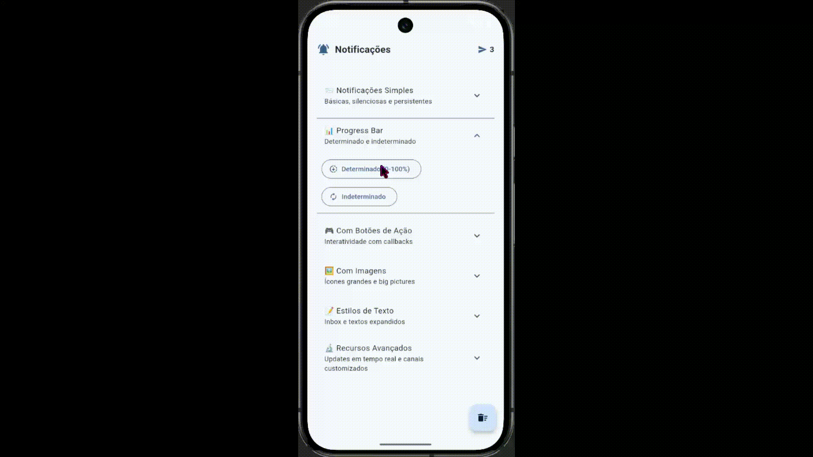
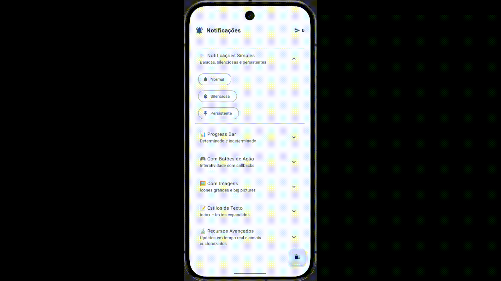

# 🔔 Flet Android Notify

<div align="center">

<p>
  <a href="README.md">🇺🇸 English</a> •
  <a href="README.pt-BR.md">🇧🇷 Português</a>
</p>


**Complete Android notification system for Flet applications**

An elegant and pythonic Python library to create native Android notifications with support for progress bars, interactive buttons, multiple styles, and much more.

[Features](#-features) • [Installation](#-installation) • [Quick Start](#-quick-start) • [Documentation](#-documentation) • [Demo](#-demo-app)


</div>

---

## 🎯 Why This Project?

If you've ever tried to create Android notifications in Flet, you know the pain: either you dive straight into Java/Kotlin with JNI (spoiler: it's a nightmare), or you use sketchy libs that barely work. This project solves this in a **pythonic**, **type-safe**, and **battle-tested** way.

**What makes it different?**
- ✅ Fluent and intuitive API (builder pattern)
- ✅ Complete support for all Android notification styles
- ✅ Type hints everywhere (your IDE will love you)
- ✅ Robust error handling
- ✅ Comprehensive documentation
- ✅ Full demo app included
- ✅ Declarative UI with `@ft.component` and `@ft.observable`

## 🚀 Features

### Basic Notifications
- 📨 **Simple**: Classic title + message
- 🔇 **Silent**: No sound or vibration
- 📌 **Persistent**: Cannot be dismissed by swiping


### Advanced Notifications
- 📊 **Progress Bar**: Determinate (0-100%) and indeterminate
- 🎮 **Action Buttons**: Up to 3 interactive buttons with callbacks
- 🖼️ **Images**: Large icon, big picture, or both
- 📝 **Text Styles**: Inbox style (message list) and big text (expandable long text)



### Professional Features
- ⚡ **Real-time Updates**: Modify notifications after sending
- 🎨 **Custom Channels**: Full control over importance and behavior
- 🔧 **Dev Mode**: Simulates notifications on Windows for development
- 🛡️ **Type Safety**: Enums and dataclasses to prevent silly mistakes



## 📦 Installation

### Prerequisites

```
Python 3.10+
Flet 0.80.5+
Android SDK (for building)
```

### Quick Installation

1. **Clone the repository:**
```bash
git clone https://github.com/Alisonsantos77/flet_android_notify.git
cd flet_android_notify
```

2. **Install dependencies:**
```bash
pip install .
```

3. **Configure `pyproject.toml` for Android:**
```toml
[tool.flet.android]

dependencies = [
    "pyjnius",
    "android-notify==1.60.10"
]

[[tool.flet.android.permissions]]
name = "android.permission.POST_NOTIFICATIONS"
```

4. **Build for Android:**
```bash
flet build apk
```

> **⚠️ Important**: The `android-notify` library only works on real Android devices. For development on Windows, the app automatically enters simulation mode.

## 💻 Quick Start

### Basic Example

```python
import flet as ft
from flet_notify import FletNotify

def main(page: ft.Page):
    notifier = FletNotify(page)
    
    if not notifier.check_permission():
        notifier.request_permission()
    
    notifier.send(
        title="Hello, World!",
        message="Your first notification with Flet!"
    )

ft.run(main)
```

### Example with Progress Bar

```python
import asyncio
from flet_notify import FletNotify

async def download_file(page):
    notifier = FletNotify(page)
    
    progress = notifier.create(
        title="Download in progress",
        message="Downloading file..."
    ).with_progress(0, 100).send()
    
    for i in range(0, 101, 10):
        await asyncio.sleep(0.5)
        progress.update_progress(i, message=f"{i}% completed")
    
    progress.remove_progress("Download complete!", show_briefly=True)
```


### Example with Interactive Buttons

```python
def on_accept():
    print("User accepted!")

def on_decline():
    print("User declined!")

notifier.create(
    title="Meeting Invitation",
    message="Meeting at 3 PM - Confirm your attendance"
).add_button("Accept", on_accept)\
 .add_button("Decline", on_decline)\
 .send(persistent=True)
```


### Example with Inbox Style

```python
notifier.create(
    title="5 new messages",
    message="WhatsApp"
).add_line("John: Hey, how are you?")\
 .add_line("Mary: Meeting at 3 PM!")\
 .add_line("Peter: PR approved! 🎉")\
 .add_line("Anna: Congratulations!")\
 .add_line("Carlos: Pizza today?")\
 .send()
```


### Example with Images

```python
notifier.create(
    title="@user commented",
    message="Amazing photo! Love the details."
).set_large_icon("assets/profile.png")\
 .set_big_picture("assets/post.png")\
 .send()
```


## 📚 Complete Documentation

### API Reference

#### `FletNotify(page: ft.Page)`

Main class for managing notifications.

**Methods:**

| Method | Description | Return |
|--------|-------------|--------|
| `check_permission()` | Check if notification permission is granted | `bool` |
| `request_permission()` | Request permission from user | `bool` |
| `send(title, message, ...)` | Send simple notification | `FletNotification` |
| `create(title, message, ...)` | Create builder for custom notification | `NotificationBuilder` |
| `create_channel(...)` | Create custom notification channel | `None` |
| `cancel_all()` | Cancel all active notifications | `None` |

#### `NotificationBuilder`

Fluent builder for creating complex notifications.

**Configuration Methods:**

```python
builder = notifier.create("Title", "Message")

builder.set_icon("assets/icon.png")
builder.add_button("Action", callback_function)
builder.with_progress(current=0, max_value=100)
builder.set_large_icon("assets/profile.png")
builder.set_big_picture("assets/photo.png")
builder.set_big_text("Long text...")
builder.add_line("Line 1")
builder.add_line("Line 2")

notification = builder.send(
    silent=False,
    persistent=False,
    close_on_click=True
)
```

#### `FletNotification`

Object returned after sending a notification. Allows real-time updates.

**Methods:**

```python
notification = notifier.send(...)

notification.update_title("New Title")
notification.update_message("New message")
notification.update_progress(
    current=50,
    title="Downloading...",
    message="50% completed"
)
notification.remove_progress(
    message="Completed!",
    show_briefly=True
)
notification.cancel()
```

### Available Enums

#### `NotificationImportance`

Controls the notification importance level:

```python
NotificationImportance.URGENT   # Maximum priority (sound + heads-up)
NotificationImportance.HIGH     # High priority (sound)
NotificationImportance.MEDIUM   # Medium priority (no sound)
NotificationImportance.LOW      # Low priority (minimized)
NotificationImportance.NONE     # No visible notification
```

#### `NotificationStyle`

Defines the visual style of the notification:

```python
NotificationStyle.SIMPLE        # Simple title + message
NotificationStyle.PROGRESS      # With progress bar
NotificationStyle.INBOX         # Message list
NotificationStyle.BIG_TEXT      # Expandable long text
NotificationStyle.LARGE_ICON    # With large icon
NotificationStyle.BIG_PICTURE   # With large image
NotificationStyle.BOTH_IMAGES   # Icon + image
```

## 🎨 Demo App

The project includes a complete demonstration app with all features.


### Running the Demo Locally

```bash
# Windows (simulation mode)
flet run src/main.py

# Android (real notifications)
flet build apk
```

### Demo Structure

```
src/
├── main.py              # Main app with declarative UI
├── flet_notify.py       # Core library
└── assets/              # Resources (images, icons)
```

The demo includes examples of:
- ✅ All notification types
- ✅ Animated progress bars
- ✅ Interactive buttons
- ✅ Real-time updates
- ✅ Custom channels
- ✅ Complex sequences

## 🏗️ Architecture

This project uses Flet 0.80.5's declarative UI approach with `@ft.component` and `@ft.observable`, keeping state and UI cleanly separated.

```python
@dataclass
@ft.observable
class AppState:
    notification_count: int = 0
    dev_mode: bool = False
    notifier: object = None

@ft.component
def App():
    state, _ = ft.use_state(AppState())
    ...
```

Each section of the UI is an isolated component that re-renders automatically when the shared `AppState` changes — no manual `page.update()` calls needed across the board.

## 🛠️ Development

### Project Structure

```
flet_android_notify/
├── src/
│   ├── main.py                 # Complete demo app
│   ├── flet_notify.py          # Main library
│   └── assets/                 # App resources
├── pyproject.toml              # Flet configuration
├── README.md                   # This file
└── LICENSE                     # MIT License
```

### Developer Mode

The project automatically detects when running outside Android and enters "dev mode":

```python
state.dev_mode = page.platform != ft.PagePlatform.ANDROID

if state.dev_mode:
    state.increment()
    _show_snack(f"🔧 DEV: Simulating '{action_name}'")
    return True
```

This allows developing and testing the complete UI without needing to build for Android every time.

## 🐛 Troubleshooting

### Issue: `DeprecationWarning: only() is deprecated`
**Cause**: `ft.border.only()` was deprecated in Flet 0.80.0.
**Solution**: Replace with `ft.Border.only()`:
```python
border=ft.Border.only(bottom=ft.BorderSide(1, BORDER))
```

### Issue: "PlatformNotSupportedException"
**Cause**: Trying to use notifications on an unsupported platform.
**Solution**: Dev mode should detect automatically. Check if you're using the latest version.

### Issue: "PermissionDeniedException"
**Cause**: User denied notification permission.
**Solution**:
```python
if not notifier.check_permission():
    notifier.request_permission()
```

### Issue: "AndroidNotifyNotAvailableException"
**Cause**: `android-notify` library not installed or configured.
**Solution**: Check `pyproject.toml`:
```toml
[tool.flet.android]
dependencies = ["android-notify==1.60.10"]
```

### Issue: Notifications don't appear on Android 13+
**Cause**: Missing POST_NOTIFICATIONS permission.
**Solution**: Add to `pyproject.toml`:
```toml
[[tool.flet.android.permissions]]
name = "android.permission.POST_NOTIFICATIONS"
```

## 🤝 Contributing

Contributions are very welcome! Whether fixing a bug, adding a feature, or improving documentation.

### How to Contribute

1. Fork the project
2. Create a branch for your feature (`git checkout -b feature/MyFeature`)
3. Commit your changes (`git commit -m 'feat: Add MyFeature'`)
4. Push to the branch (`git push origin feature/MyFeature`)
5. Open a Pull Request

### Commit Conventions

We use [Conventional Commits](https://www.conventionalcommits.org/):

```
feat: New feature
fix: Bug fix
docs: Documentation changes
style: Formatting, semicolons, etc
refactor: Code refactoring
chore: Maintenance tasks
```

## 📜 License

This project is under the MIT license. See the [LICENSE](LICENSE) file for more details.

## 💡 Inspiration and Credits

This project was inspired by and built upon the excellent work of **[Agusss (MasterA5)](https://github.com/Agusss)**, especially their [FletNotification](https://github.com/Agusss/FletNotification) repository.

Essential for understanding how to integrate Android notifications with Flet using PyJNIus and the android-notify library. Many concepts and patterns used here were adapted and expanded from that pioneering work.

**Main differences of this fork/reimplementation:**
- 🏗️ Declarative architecture with `@ft.component` and `@ft.observable`
- 📝 Comprehensive documentation in both English and Portuguese
- 🎨 Professional and complete demo app
- 🛡️ Type hints and type safety
- 🔧 Developer mode for local testing
- 📊 Expanded support for all notification styles

## 👨‍💻 Author

**Alison Santos**  
🇧🇷 Backend Python Developer  
📧 [GitHub](https://github.com/Alisonsantos77)

---

<div align="center">

**If this project was useful, leave a ⭐!**

Made with ❤️ and lots of ☕ by Python developers

[⬆ Back to top](#-flet-android-notify)

</div>